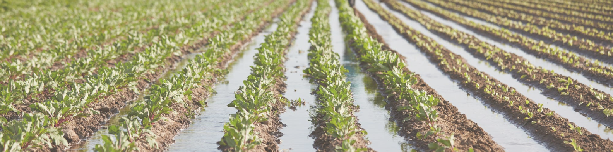

# Optimización de Recursos Hídricos en Región Agricola de Mendoza

Mendoza, conocida por su clima árido y sus viñedos de renombre mundial, enfrenta el desafío constante de gestionar sus recursos hídricos de manera eficiente. La disponibilidad de agua es crucial para la agricultura, especialmente para la viticultura, que es una de las principales actividades económicas de la región. En este contexto, la aplicación de técnicas de Data Science ofrece una solución innovadora para optimizar el uso del agua, asegurando la sostenibilidad y productividad de los cultivos.

## Descripción del Proyecto
Este proyecto tiene como objetivo optimizar el uso de recursos hídricos en Mendoza mediante el análisis de datos climáticos y de humedad del suelo. Utilizando técnicas de Data Science, buscamos desarrollar un modelo que permita una gestión más eficiente del riego agrícola, contribuyendo a la sostenibilidad y productividad de la región.

## Metodología
- **Recopilación de Datos:** Obtendremos datos climáticos de NOAA's National Centers for Environmental Information (NCEI) y datos de humedad del suelo de ISRIC - World Soil Information.
- **Análisis Exploratorio de Datos (EDA):** Realizaremos un análisis exhaustivo para entender las características de los datos y su relación con las necesidades hídricas.
- **Desarrollo de Modelos Predictivos:** Utilizaremos técnicas de Machine Learning para predecir las necesidades de riego en función de las condiciones climáticas y de suelo.
- **Implementación:** Crearemos una plataforma para que los agricultores puedan acceder a recomendaciones de riego basadas en los modelos desarrollados.

## Tecnologías Utilizadas
- **Lenguajes de Programación:** Python
- **Bases de Datos:** PostgreSQl
- **Visualización de Datos:** Power BI
- **Herramientas de Gestión de Proyectos:** Trello, GitHub
