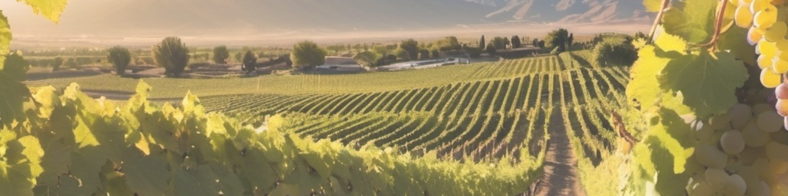

# Predicciones Climáticas para la Toma de Decisiones en Prácticas Vitivinícolas en la Región de Mendoza

## Descripción del Proyecto
Este proyecto tiene como objetivo desarrollar un modelo predictivo para condiciones climáticas específicas en la Región de Mendoza, Argentina, con el fin de optimizar las prácticas vitivinícolas. Utilizando datos climáticos históricos y técnicas avanzadas de Machine Learning, buscamos proporcionar a los viticultores herramientas precisas para la toma de decisiones informadas que mejoren la eficiencia y calidad de la producción de vino.

## Puntos Claves del Proyecto
- **Predicción Climática:** Desarrollar modelos predictivos para variables climáticas clave como temperatura mínima (TMIN), temperatura máxima (TMAX), temperatura promedio (TAVG), precipitación y nevadas.
- **Optimización de Prácticas Vitivinícolas:** Utilizar las predicciones climáticas para informar decisiones en aspectos críticos del cultivo de la vid.
- **Escalabilidad y Reproducibilidad:** Crear un flujo de trabajo escalable y reproducible que pueda ser aplicado a otras regiones vitivinícolas.

## Metodología
- **Recopilación de Datos:** Se obtuvieron datos climáticos de NOAA's National Centers for Environmental Information (NCEI) de la Provincia de Mendoza en Argentina, correspondiente a la estación `AR000087418`, correspondiente a la estación `AERO MENDOZA, AR`.
- **Análisis Exploratorio de Datos (EDA):** Se realizó un análisis exhaustivo para entender las características de los datos que puedan aportar a las prácticas de viticultura en la Región.
- **Desarrollo de Modelos Predictivos:** Se utilizaron técnicas de Machine Learning para predecir las condiciones climáticas para que aporten a la toma de decisiones en las prácticas vitivinicolas en la Región.
- **Implementación:** Se Creó una plataforma para que los agricultores puedan acceder a condiciones climáticas de la Región y predicción mediante el modelo desarrollado.

### Tecnologías Utilizadas
- **Lenguajes de Programación:** Python
- **Visualización de Datos:** Power BI
- **Herramientas de Gestión de Proyectos:** Trello, GitHub

### Diccionario de Variables del Dataset
| Variable          | Tipo        | Descripción                                     |
|-------------------|-------------|-------------------------------------------------|
| `date`            | Categórica  | Fecha en formato datetime                       |
| `year`            | Numérica    | Año                                             |
| `month`           | Numérica    | Mes                                             |
| `day`             | Numérica    | Día del mes                                     |
| `season`          | Categórica  | Estación del año (autumn, winter, spring, summer) |
| `phenology_cycle` | Categórica  | Ciclo fenológico (7 categorías diferentes)      |
| `tmin`            | Numérica    | Temperatura mínima                              |
| `tmax`            | Numérica    | Temperatura máxima                              |
| `tavg`            | Numérica    | Temperatura promedio                            |
| `precipitation`   | Numérica    | Precipitación (mm)                              |
| `snowfall`        | Numérica    | Nieve caída (mm)                                |

## Como Contribuir
Para contribuir a este proyecto, por favor sigue estos pasos:
- Haz un fork del repositorio.
- Crea una nueva rama (git checkout -b feature/nueva-caracteristica).
- Realiza tus cambios y haz commit (git commit -m 'Agrega nueva característica').
- Empuja tu rama (git push origin feature/nueva-caracteristica).
- Abre un Pull Request.

## Contacto
Para preguntas o más información sobre el proyecto, puedes contactar a:
- **Arelys Acevedo** - *Data Analyst* | LinkedIn: https://www.linkedin.com/in/arelys-acevedo | GitHub: https://github.com/acad2018
- **Ariana Maldonado** - *Data Analyst* | LinkedIn: https://www.linkedin.com/in/arelys-acevedo | GitHub: https://github.com/AriMaldo19
- **Brayan C'carita Cruz** - *Data Analyst* | LinkedIn: https://www.linkedin.com/in/arelys-acevedo | GitHub: https://github.com/hallzyx
- **Cecilia Aponte** - *Data Scienctist* | LinkedIn: https://www.linkedin.com/in/ceci-aponte-data | GitHub: https://github.com/CCAponte
- **Fidel Vera Chourio** - *Data Scientist* | LinkedIn: https://www.linkedin.com/in/fverachourio | GitHub: https://github.com/fevc08
- **Noe Machaca Chambilla** - *Data Analyst* | LinkedIn: https://www.linkedin.com/in/noe-u-machaca | GitHub: https://github.com/newneo4
- **Raul Almao** - *Data Scientist* | LinkedIn: https://www.linkedin.com/in/ralmao | GitHub: https://github.com/Ralmao